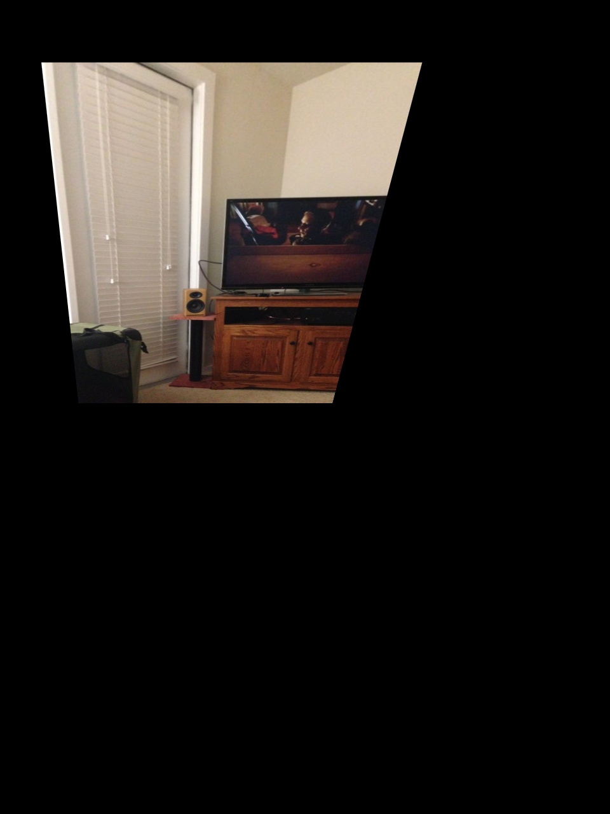
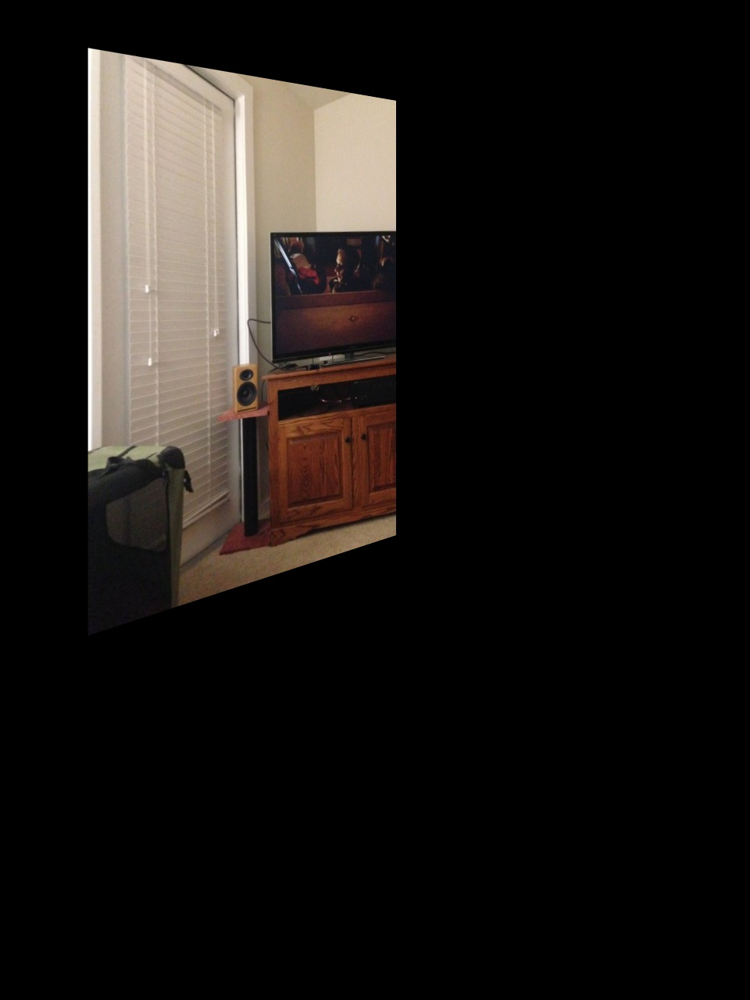

# 沿指定轴的投影变换
## Perspective transformation along specified axis
图像的3D投影变换，绕x轴旋转、绕y轴旋转、绕z轴旋转

##### 原始图像  origin image

##### 绕x轴旋转30度  rotate around x axis

##### 绕y轴旋转30度 rotate around y axis

##### 绕z轴旋转30度 rotate around z axis

